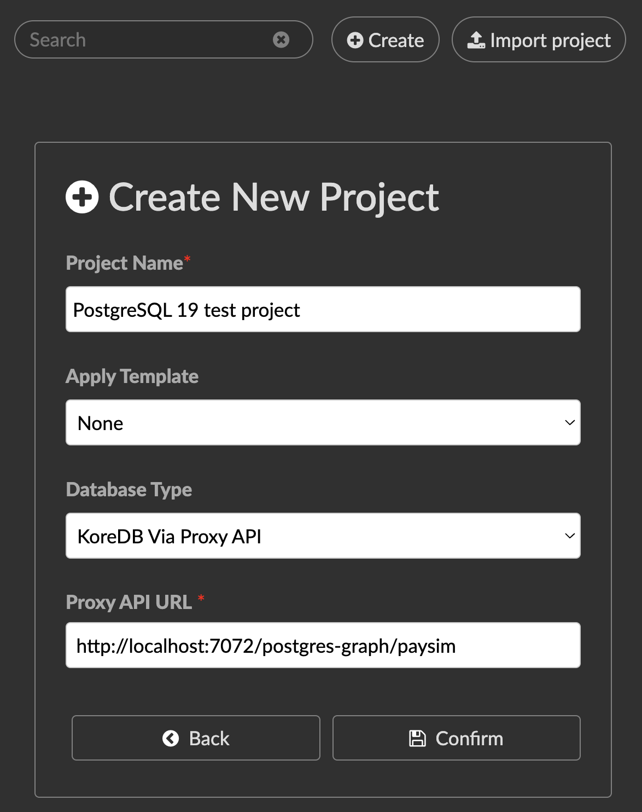

# PostgreSQL 19 → Kineviz bridge

This bridge lets you query a **PostgreSQL 19 property graph** directly
from **[Kineviz](https://www.kineviz.com/)**.

Kineviz normally talks to graph databases like Neo4j, Spanner Graph, BigQuery Graph,
and KoreDB. This bridge sits between PostgreSQL 19 and Kineviz: Kineviz sends it a graph
query, and the bridge translates that query into PostgreSQL's graph syntax, runs it, and
hands the results back in the exact JSON shape Kineviz expects. To Kineviz, it looks like
an ordinary KoreDB connection that accepts Cypher.

> **What's KoreDB?** KoreDB is a Kineviz-managed fork of the open-source
> [KuzuDB](https://kuzudb.com/). Because it's a fork, KoreDB and KuzuDB share the same
> HTTP + JSON interface, and that shared interface is exactly what this bridge imitates.
> So anywhere Kineviz can connect to KoreDB, it can connect to this bridge instead.

> ⚠️ **Beta / experimental.** Built against **PostgreSQL 19 Beta 1** and its new SQL/PGQ
> graph feature. PostgreSQL 19 is not released yet, and its behavior can still change.
> We track each PostgreSQL 19 release and update this bridge. **Use at your own risk** —
> there is no warranty. Several query features are **not supported yet**
> (see [what's not supported](docs/limitations.md)).

---

## Quick start

Go from clone to querying the PaySim graph in Kineviz.

**1. Start PostgreSQL 19 and load the demo data** (fully synthetic, bundled — no download):

```bash
git clone https://github.com/Kineviz/postgresql-kineviz-bridge
cd postgresql-kineviz-bridge

# PostgreSQL 19 Beta, with the SQL/PGQ graph feature
docker run -d --name pg19beta -e POSTGRES_PASSWORD=pgpw -e POSTGRES_DB=appdb \
    -p 5433:5432 postgres:19beta1

# build the PaySim graph (auto-unzips the bundled data)
./scripts/load_paysim.sh
```

**2. Start the bridge** — the server Kineviz connects to. Leave it running:

```bash
pip install "psycopg[binary]"
python3 pg_kineviz_server.py --backend pg \
    --dsn "host=127.0.0.1 port=5433 dbname=appdb user=postgres password=pgpw" \
    --graph paysim --port 7072 --host ::
```

It now serves the graph at `http://localhost:7072/postgres-graph/paysim`.

**3. Open Kineviz.** Create a free account at [kineviz.com](https://www.kineviz.com/), then
either **Launch Kineviz in your browser** or **Download Kineviz Desktop**.

> **Tip:** the **desktop app** is the simplest way to reach a bridge on `localhost` — a
> browser tab served over HTTPS may block calls to a plain-HTTP `localhost` address.

**4. Create a project pointing at the bridge.** Click **Create → Create New Project**, then set:

- **Database Type:** `KoreDB Via Proxy API`
- **Proxy API URL:** the address the bridge printed in step 2. With the defaults above that's
  `http://localhost:7072/postgres-graph/paysim` — but it differs if you used another port or
  `--graph` name, so use whatever your bridge actually shows.



Click **Confirm**. Kineviz loads the graph's schema (7 node types, 7 edge types).

**5. Run a query.** Try the fraud pattern — a flagged client moving money to another client:

```cypher
MATCH (c:Client)-[:PERFORMS]->(t:Transaction)-[:TO_CLIENT]->(d:Client)
WHERE c.isfraud = true
RETURN c, t, d LIMIT 25
```

You're now querying PostgreSQL 19 as a graph, live, from Kineviz.

---

## What is SQL/PGQ?

PostgreSQL 19 adds a standard way to store and query a **graph** (dots connected by
lines) directly inside a normal SQL database. You define which tables are the "dots"
(nodes) and which are the "lines" (edges), then query them with graph patterns. This
bridge lets Kineviz drive those graph queries using the language it already speaks
(Cypher).

## A quick example

Kineviz sends this query to the bridge:

```cypher
MATCH (c:Client)-[t:PERFORMS]->(tx:Transaction)
WHERE c.isfraud = true
RETURN c, t, tx LIMIT 10
```

The bridge turns it into PostgreSQL 19's graph syntax:

```sql
SELECT * FROM GRAPH_TABLE (paysim
  MATCH (c IS Client WHERE c.isfraud = true) -[t IS PERFORMS]-> (tx IS Transaction)
  COLUMNS (...) ) LIMIT 10
```

runs it, and returns the rows as graph JSON (`{nodes, relationships}`) — which Kineviz
draws on the canvas.

## How node "id"s work (the important trick)

Kineviz needs every dot to carry a permanent tag (an **id**), so that when you click a
dot and press **Expand**, it can ask the database for *that exact* dot's neighbors.
KoreDB and Neo4j hand out these tags automatically. A PostgreSQL table doesn't — a row
is identified by its own columns, not by a graph id.

The bridge solves this by **inventing a tag for each node and keeping a lookup table**
of what each tag stands for. Here it is with real values:

```
1. You run:  MATCH (c:Client) RETURN c LIMIT 1
   PostgreSQL returns the row for Client id = 4000262298158823.

2. The bridge tags that node "0:0"  (table 0 = Client, row 0)
   and remembers:   "0:0"  ->  Client, id = 4000262298158823
   It also puts the real id into the node's properties, so you can see it.

3. Kineviz draws the dot. You click it and press Expand.
   Kineviz sends the tag back:
     MATCH (n)-[r]-(m) WHERE id(n) IN [internal_id(0, 0)] RETURN n, r, m

4. The bridge looks up "0:0", gets id = 4000262298158823, and rewrites the
   query into something PostgreSQL understands:
     ... WHERE c.id = '4000262298158823' ...

5. The neighbors come back, each gets its own tag (e.g. "3:1742"), and
   Kineviz draws them connected to your dot.
```

So the whole trick is a **made-up tag plus a lookup table** that translates between
Kineviz's tag and PostgreSQL's real key column. This lives in
[`pg_kineviz_proxy/identity.py`](pg_kineviz_proxy/identity.py).

### Know the limits of these tags

The tags live in the **bridge's memory**, not in PostgreSQL. They're handed out in the
order nodes are first seen, and they only last while the bridge keeps running. Two things
to watch out for:

- **Restarting the bridge resets the tags.** After a restart the lookup table starts
  empty. Any dots still on your Kineviz canvas (or in a saved project) carry old tags the
  new bridge doesn't recognize, so **expanding those dots won't work** until you re-run
  the query that loads them fresh (which mints new tags).
- **If the source data changes, old tags can go stale.** A tag remembers a row by its
  **key** (e.g. Client `id = 4000262298158823`). If that row is later **deleted** or its
  **key value changes**, the tag now points at a row that isn't there, so expand comes
  back empty. Editing other columns is fine — only the key matters.

Example: you load a client, save the Kineviz project, and a week later a data refresh
gives that client a new `id`. Re-opening the project and expanding that client returns
nothing, because the saved tag still points at the old `id`.

Rule of thumb: after a big data change or a bridge restart, reload from a fresh query
rather than expanding old dots. See [what's not supported](docs/limitations.md) for more.

## Try it without a database

You don't need PostgreSQL to see the bridge work. This runs a small built-in sample
graph in memory and shows the queries Kineviz would send and the answers it gets back:

```bash
python3 scripts/simulate_kineviz.py          # summaries + the generated SQL
python3 scripts/simulate_kineviz.py --full   # full JSON responses
python3 tests/test_pipeline.py               # run the tests (or: python3 -m pytest)
```

Start the server Kineviz connects to (still no database — uses the in-memory sample):

```bash
python3 pg_kineviz_server.py --backend mock --port 7001
# In Kineviz, add a KoreDB via Proxy API connection pointing at:
#   http://localhost:7001/postgres-graph/business_network
```

## Try it against real PostgreSQL 19

```bash
# 1. Start PostgreSQL 19 Beta with the SQL/PGQ graph feature
docker run -d --name pg19beta -e POSTGRES_PASSWORD=pgpw -e POSTGRES_DB=appdb \
    -p 5433:5432 postgres:19beta1
docker exec -i pg19beta psql -U postgres -d appdb < fixtures/business_network_pg19.sql

# 2. Point the bridge at it
pip install "psycopg[binary]"
python3 pg_kineviz_server.py --backend pg \
    --dsn "host=127.0.0.1 port=5433 dbname=appdb user=postgres password=pgpw" \
    --graph business_network --port 7071 --host ::
```

The bridge reads the graph's schema straight from PostgreSQL (via the Information
Schema), so it works on **any** property graph you define — no per-dataset configuration.

## Sample datasets

| Dataset | Size | Build it | Serve it |
|---|---|---|---|
| **business_network** | 6 nodes / 7 edges — a tiny toy graph (Person / Company / KNOWS / WORKS_AT) | [`fixtures/business_network_pg19.sql`](fixtures/business_network_pg19.sql) | `--graph business_network` |
| **PaySim** | ~178k nodes / ~347k edges — a fraud dataset (7 node types, 7 edge types) | [`scripts/load_paysim.sh`](scripts/load_paysim.sh) | `--graph paysim` |

> **Both datasets ship with the repo — no downloads.** `business_network` is a single SQL
> file; the full PaySim dataset (fully synthetic — no real people) is bundled as compressed
> CSVs in `fixtures/paysim/paysim_data.zip` (~8 MB), which `load_paysim.sh` unzips
> automatically on first run. To load a different PaySim copy instead, point the loader at
> it: `PAYSIM_DIR=/path/to/paysim ./scripts/load_paysim.sh`.

PaySim models clients, transactions, merchants and banks, plus the shared email / phone /
SSN links that expose fraud rings. For how PostgreSQL 19's graph syntax stacks up against
Spanner Graph's, see the
[SQL/PGQ ↔ Spanner Graph comparison](docs/spanner-vs-postgresql19-sqlpgq.md).

> PaySim is a synthetic simulation by **Dr. Edgar Lopez-Rojas**
> ([PaySim](https://github.com/EdgarLopezPhD/PaySim), GPL-3.0), generated here via PaySim 2
> (David Voutila). The bundled CSVs are synthetic output; if you use them, please cite the
> PaySim paper — see [`fixtures/paysim/README.md`](fixtures/paysim/README.md).

## What's supported (and what isn't)

Supported today: node/edge patterns, fixed-length multi-hop paths, `WHERE` (full
`AND`/`OR`/`NOT` and all the common operators), aggregation (`count`/`sum`/`avg`/`min`/
`max`, `GROUP BY`, `DISTINCT`), `ORDER BY`, `LIMIT`, and table-style returns.

Not supported yet (the bridge rejects these with a clear error rather than guessing):
variable-length paths (PostgreSQL 19 Beta doesn't have them yet), `OPTIONAL MATCH`,
`WITH`, `UNWIND`, `HAVING`, and subqueries. The bridge is **read-only** by design.

For the full list and the reasons, see [what's not supported](docs/limitations.md). For
how each Cypher piece maps to PostgreSQL, see
[the mapping guide](docs/cypher-to-sqlpgq-mapping.md).

## Feedback

This is early and we'd genuinely like your input.

- **Found a bug or a query that doesn't work?** Open a [GitHub Issue](../../issues).
- **Have a question or an idea?** Start a [GitHub Discussion](../../discussions).

## Project layout

```
pg_kineviz_server.py          the server Kineviz connects to
pg_kineviz_proxy/
  backend.py                  shared types + the backend interface
  identity.py                 the node-id tag + lookup table (see above)
  cypher_translator.py        turns a Cypher query into a query plan
  mock_backend.py             the in-memory sample graph (no database)
  pg_backend.py               turns the plan into PostgreSQL graph SQL + runs it
  predicate.py                parses WHERE conditions
  result_converter.py         turns PostgreSQL rows back into graph JSON
  query_processor.py          checks and routes each incoming query
  metadata.py                 reads the graph's structure from PostgreSQL
  envelope.py                 formats the JSON exactly as Kineviz expects
  query_log.py                logs every request for testing
scripts/simulate_kineviz.py   run sample queries and show the answers
tests/                        tests + captured real Kineviz queries
```

## License

[MIT](LICENSE) © Kineviz
